# Control de Versión en el Desarrollo de Software - Guía Completa de Git

## 📚 Tabla de Contenidos

1. [Definición de Control de Versiones](#1-definición-de-control-de-versiones)
2. [Aplicación del Control de Versiones y su Importancia](#2-aplicación-del-control-de-versiones-y-su-importancia)
3. [Herramientas para el Manejo de Versiones](#3-herramientas-para-el-manejo-de-versiones)
4. [Uso de la Herramienta GIT](#4-uso-de-la-herramienta-git)
5. [Comandos Básicos para la Administración de Código Fuente](#5-comandos-básicos-para-la-administración-de-código-fuente)

---

## 1. Definición de Control de Versiones

### ¿Qué es el Control de Versiones?

El **control de versiones** es un sistema que registra los cambios realizados en archivos a lo largo del tiempo, permitiendo recuperar versiones específicas más adelante. Es fundamental en el desarrollo de software moderno.

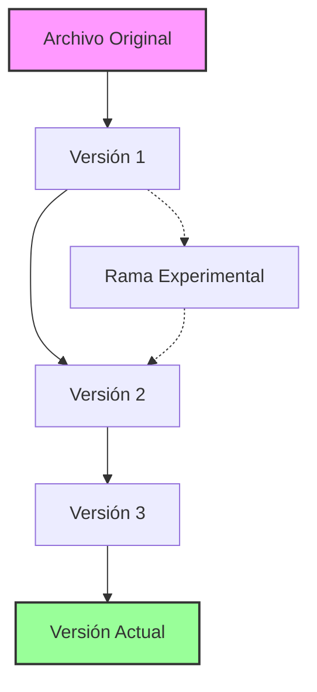

### Características Principales

- **Historial Completo**: Cada cambio queda registrado con quién, cuándo y por qué
- **Reversibilidad**: Posibilidad de volver a cualquier versión anterior
- **Colaboración**: Múltiples personas pueden trabajar simultáneamente
- **Respaldo**: Cada copia es un backup completo del proyecto
- **Experimentación Segura**: Crear ramas para probar sin afectar el código principal

### Tipos de Sistemas de Control de Versiones

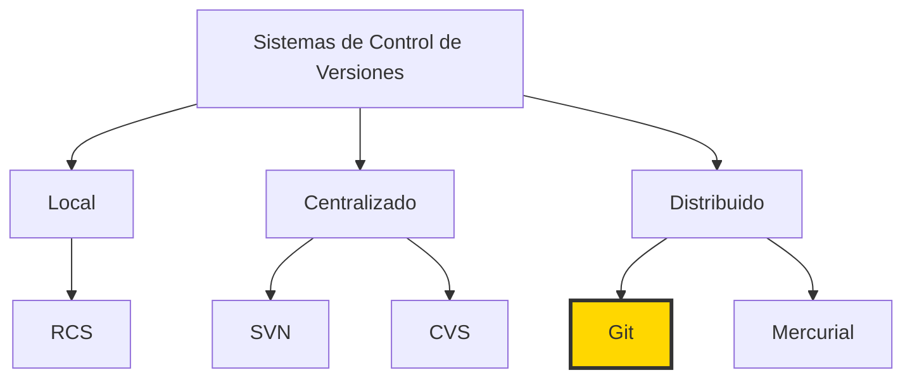

---

## 2. Aplicación del Control de Versiones y su Importancia

### 2.1 En Trabajo Colaborativo Durante el Desarrollo de Software

#### ¿Por qué es Crucial en Equipos?

El control de versiones es **indispensable** cuando múltiples desarrolladores trabajan en el mismo proyecto:

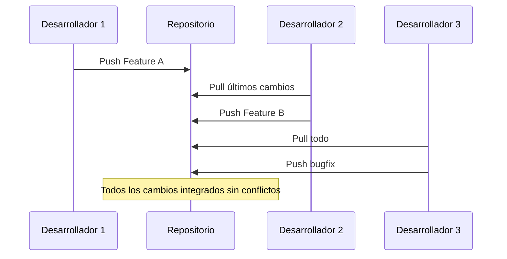

#### Beneficios en Trabajo Colaborativo

1. **Trabajo Paralelo**: Cada desarrollador trabaja en su rama
2. **Integración Controlada**: Los cambios se revisan antes de fusionar
3. **Resolución de Conflictos**: Sistema para manejar cambios simultáneos
4. **Responsabilidad Clara**: Se sabe quién hizo cada cambio
5. **Comunicación Mejorada**: Los mensajes de commit documentan decisiones

#### Ejemplo Práctico de Colaboración

```bash
# Developer 1 trabaja en nueva característica
git checkout -b feature/login
# ... hace cambios ...
git add .
git commit -m "feat: agregar sistema de login"
git push origin feature/login

# Developer 2 trabaja en otra característica
git checkout -b feature/dashboard
# ... hace cambios ...
git add .
git commit -m "feat: crear dashboard principal"
git push origin feature/dashboard

# Ambos se integran sin problemas al main
```

### 2.2 En el Manejo de Versiones del Código Fuente

#### Control de Versiones del Código

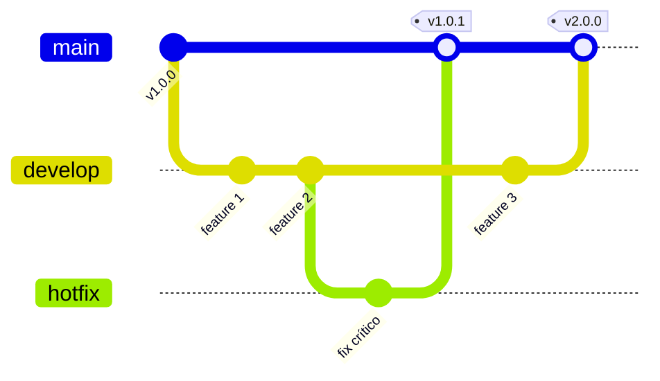

#### Ventajas del Manejo de Versiones

| Aspecto | Sin Control de Versiones | Con Control de Versiones |
|---------|-------------------------|--------------------------|
| **Backup** | Manual, propenso a errores | Automático y confiable |
| **Historial** | Perdido o incompleto | Completo y detallado |
| **Colaboración** | Caótica, sobrescritura | Organizada y segura |
| **Reversión** | Difícil o imposible | Simple y rápida |
| **Experimentación** | Riesgosa | Segura con branches |

---

## 3. Herramientas para el Manejo de Versiones

### 3.1 GIT

**Git** es el sistema de control de versiones distribuido más popular del mundo, creado por Linus Torvalds en 2005.

#### Características de Git

- ✅ **Distribuido**: Cada clon es un repositorio completo
- ✅ **Rápido**: Operaciones locales instantáneas
- ✅ **Integridad**: SHA-1 para verificación de datos
- ✅ **Branching eficiente**: Crear y fusionar ramas es trivial
- ✅ **Staging Area**: Control fino sobre qué commitear

### 3.2 SVN (Subversion)

**SVN** es un sistema de control de versiones centralizado, sucesor de CVS.

#### Características de SVN

- 📦 **Centralizado**: Un servidor central almacena todo
- 📁 **Versionado de directorios**: Rastrea cambios en carpetas
- 🔢 **Números de revisión simples**: Secuenciales (1, 2, 3...)
- 🖼️ **Mejor con binarios**: Maneja bien archivos grandes

#### Comparación Git vs SVN

| Característica | Git | SVN |
|---------------|-----|-----|
| **Arquitectura** | Distribuida | Centralizada |
| **Velocidad** | Muy rápida | Moderada |
| **Offline** | Trabajo completo | Limitado |
| **Branching** | Excelente | Básico |
| **Curva de aprendizaje** | Empinada | Suave |
| **Almacenamiento** | Más eficiente | Menos eficiente |

### 3.3 Mercurial

**Mercurial** es otro sistema distribuido, similar a Git pero con enfoque en simplicidad.

#### Características de Mercurial

- 🐍 **Python-based**: Escrito principalmente en Python
- 👥 **User-friendly**: Interfaz más simple que Git
- 📊 **Buen rendimiento**: Rápido con proyectos grandes
- 🔄 **Compatible**: Puede interactuar con Git

#### ¿Cuándo elegir cada herramienta?

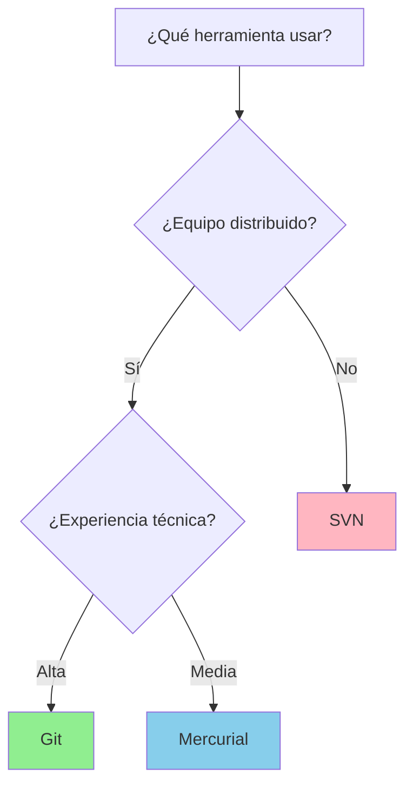

---

## 4. Uso de la Herramienta GIT

### 4.1 Introducción a GIT

Git fue creado en abril de 2005 por Linus Torvalds para el desarrollo del kernel de Linux. Su nombre es un juego de palabras británico que significa "persona desagradable" - Torvalds bromeó diciendo: "Nombro todos mis proyectos con mi nombre. Primero Linux, ahora Git."

#### Historia de Git

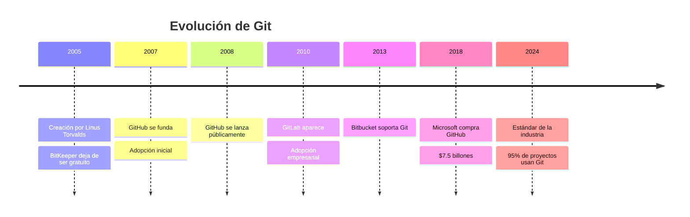

### 4.2 Funcionalidad de la Herramienta GIT

#### Arquitectura de Git

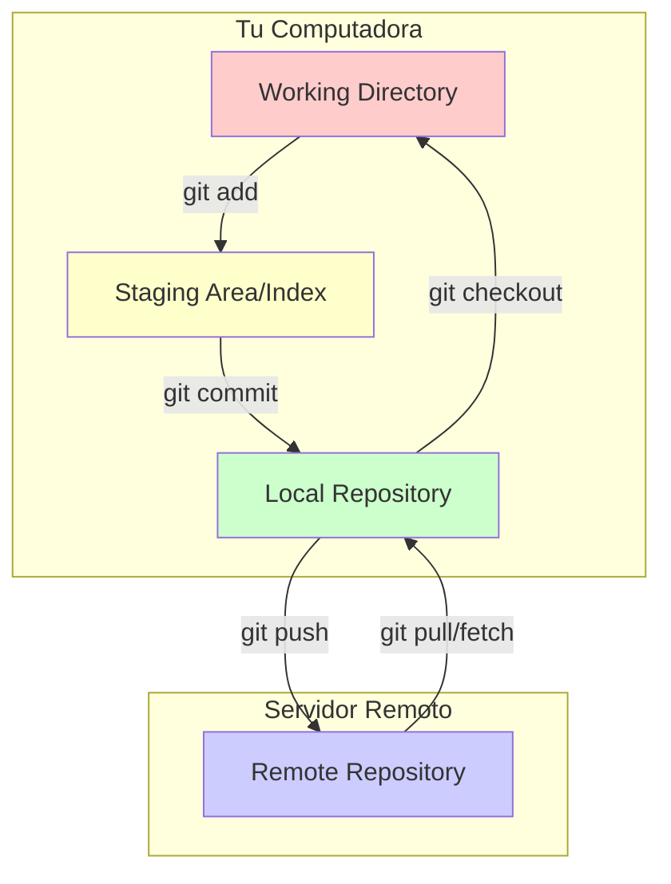

### 4.3 Conceptos

#### 4.3.1 Repositorios

Un **repositorio** es el contenedor de tu proyecto que almacena todo el historial de cambios.

```bash
# Crear un repositorio nuevo
git init mi-proyecto

# Clonar un repositorio existente
git clone https://github.com/usuario/proyecto.git
```

**Tipos de Repositorios:**
- **Local**: En tu computadora (`.git/`)
- **Remoto**: En un servidor (GitHub, GitLab, etc.)
- **Bare**: Solo para servidor, sin working directory

#### 4.3.2 Directorio de Trabajo

El **Working Directory** es donde modificas tus archivos. Es tu carpeta de proyecto normal.

```bash
mi-proyecto/
├── src/
│   ├── index.html
│   ├── styles.css
│   └── script.js
├── README.md
└── .git/           # Carpeta del repositorio (no tocar)
```

#### 4.3.3 Índice (Staging Area)

El **índice** o **staging area** es donde preparas los cambios antes del commit.

```bash
# Ver estado del índice
git status

# Agregar archivos al índice
git add archivo.txt          # Un archivo
git add *.js                # Todos los .js
git add .                   # Todo

# Quitar del índice
git reset archivo.txt
```

#### 4.3.4 HEAD

**HEAD** es un puntero que indica en qué commit estás actualmente.

```bash
# Ver dónde apunta HEAD
git log --oneline -1

# Mover HEAD a otro commit
git checkout [commit-hash]

# Volver a la rama actual
git checkout main
```

#### 4.3.5 Ramas (Branches)

Las **ramas** permiten desarrollar funcionalidades aisladas.

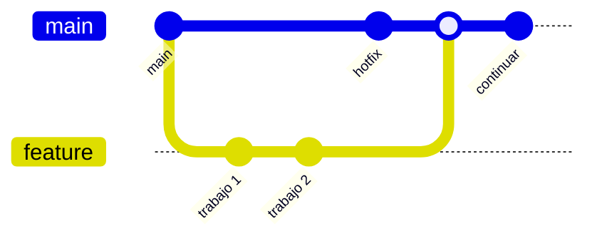

```bash
# Crear rama
git branch nueva-rama

# Cambiar a rama
git checkout nueva-rama

# Crear y cambiar (atajo)
git checkout -b nueva-rama

# Ver ramas
git branch -a

# Eliminar rama
git branch -d rama-completada
```

#### 4.3.6 Commits

Un **commit** es una instantánea de tu proyecto en un momento específico.

```bash
# Hacer commit
git commit -m "mensaje descriptivo"

# Commit con descripción larga
git commit -m "título corto" -m "descripción detallada"

# Ver historial de commits
git log --oneline --graph --all
```

**Anatomía de un Commit:**
```
commit a3f5d8e9b2c1 (HEAD -> main)
Author: Juan Pérez <juan@email.com>
Date:   Mon Jan 15 10:30:00 2024 -0500

    feat: agregar validación de formulario
    
    - Validación de email
    - Validación de campos requeridos
    - Mensajes de error amigables
```

### 4.4 Flujos de Trabajo en Git

#### 4.4.1 Pull Requests (GitHub)

Un **Pull Request** (PR) es una solicitud para integrar cambios de una rama a otra.

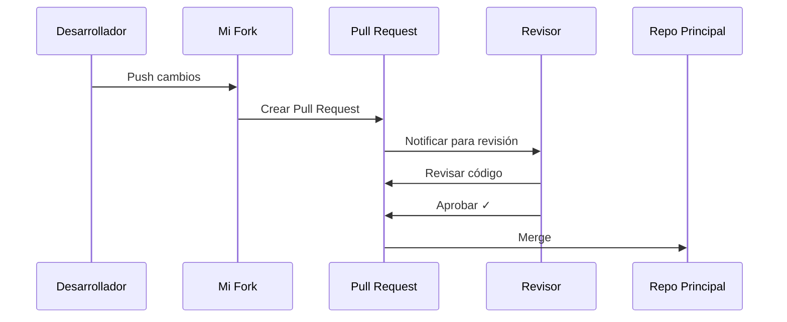

**Proceso de Pull Request:**
1. Fork del repositorio
2. Crear rama para feature
3. Hacer commits
4. Push a tu fork
5. Crear Pull Request
6. Revisión de código
7. Merge al proyecto principal

#### 4.4.2 Merge Requests (GitLab)

**Merge Request** (MR) es el equivalente de GitLab a los Pull Requests.

```bash
# Flujo típico de Merge Request
git checkout -b feature/nueva-funcionalidad
# ... hacer cambios ...
git add .
git commit -m "feat: nueva funcionalidad"
git push origin feature/nueva-funcionalidad
# Crear MR desde GitLab UI
```

### 4.5 Proveedores de Repositorios Remotos de GIT

#### 4.5.1 GitHub

**GitHub** es la plataforma más popular para hospedar repositorios Git.

**Características:**
- 🌟 **Popularidad**: Mayor comunidad open source
- 🔄 **GitHub Actions**: CI/CD integrado
- 📝 **Issues y Projects**: Gestión de proyectos
- 🔍 **Copilot**: IA para asistir en código
- 📊 **Insights**: Estadísticas detalladas

**Cuándo usar GitHub:**
- Proyectos open source
- Portfolio personal
- Colaboración con la comunidad
- Integración con herramientas populares

#### 4.5.2 GitLab

**GitLab** ofrece una suite completa de DevOps.

**Características:**
- 🚀 **CI/CD Completo**: Pipelines potentes incluidos
- 🏢 **Self-hosted**: Opción on-premise
- 🔒 **Seguridad**: Escaneo de vulnerabilidades
- 📈 **DevOps Platform**: Todo en uno
- 🆓 **Generoso plan gratuito**: Más features gratis

**Cuándo usar GitLab:**
- Necesitas CI/CD robusto
- Requisitos de seguridad estrictos
- Quieres self-hosting
- Proyectos empresariales

#### 4.5.3 Bitbucket

**Bitbucket** es la solución de Atlassian para repositorios Git.

**Características:**
- 🔗 **Integración Atlassian**: Jira, Confluence
- 👥 **Equipos pequeños**: Gratis hasta 5 usuarios
- 🏗️ **Pipelines**: CI/CD incluido
- 🔐 **Privacidad**: Repos privados ilimitados gratis
- 📱 **Aplicaciones móviles**: iOS y Android

**Cuándo usar Bitbucket:**
- Ya usas herramientas Atlassian
- Equipos pequeños
- Necesitas repos privados gratis
- Integración con Jira es crucial

#### 4.5.4 Azure DevOps

**Azure DevOps** (antes Visual Studio Team Services) es la solución de Microsoft.

**Características:**
- ☁️ **Integración Azure**: Servicios cloud de Microsoft
- 📋 **Azure Boards**: Gestión de proyectos ágil
- 🔨 **Azure Pipelines**: CI/CD muy potente
- 📦 **Azure Artifacts**: Gestión de paquetes
- 🧪 **Test Plans**: Herramientas de testing

**Cuándo usar Azure DevOps:**
- Ecosistema Microsoft
- Necesitas suite completa de DevOps
- Integración con Azure
- Equipos empresariales

#### Comparación de Proveedores

| Característica | GitHub | GitLab | Bitbucket | Azure DevOps |
|---------------|--------|--------|-----------|--------------|
| **Repos Privados Gratis** | ✅ Limitado | ✅ Sí | ✅ Sí | ✅ Sí |
| **CI/CD Incluido** | ✅ Actions | ✅ Completo | ✅ Pipelines | ✅ Pipelines |
| **Comunidad Open Source** | ⭐⭐⭐⭐⭐ | ⭐⭐⭐ | ⭐⭐ | ⭐⭐ |
| **Self-hosted** | 💰 Enterprise | ✅ Gratis | 💰 Data Center | 💰 Server |
| **Mejor para** | Open Source | DevOps Completo | Equipos Atlassian | Microsoft Stack |

### 4.6 Clientes de GIT

#### 4.6.1 Git (CLI - Command Line Interface)

El cliente oficial de línea de comandos.

**Ventajas:**
- ✅ Más potente y completo
- ✅ Disponible en todos los sistemas
- ✅ Scriptable y automatizable
- ✅ Mejor para aprender Git

**Instalación:**
```bash
# Windows (Git Bash)
# Descargar desde https://git-scm.com

# macOS
brew install git

# Linux
sudo apt-get install git  # Debian/Ubuntu
sudo yum install git      # RedHat/Fedora
```

#### 4.6.2 GitHub Desktop

Cliente gráfico oficial de GitHub.

**Características:**
- 🎨 **Interfaz simple**: Ideal para principiantes
- 🔄 **Sync button**: Simplifica push/pull
- 📊 **Diff visual**: Cambios lado a lado
- 🌳 **Branch visualization**: Vista gráfica de ramas
- 🆓 **Gratuito**: Sin limitaciones

**Ideal para:**
- Principiantes en Git
- Usuarios de GitHub
- Quienes prefieren GUI sobre CLI

#### 4.6.3 GitKraken

Cliente visual profesional y moderno.

**Características:**
- 🎯 **Interfaz intuitiva**: Drag & drop
- 📈 **Gráfico de commits**: Visualización excelente
- 🔗 **Integrations**: GitHub, GitLab, Bitbucket, Azure
- 👥 **Collaboration**: Features para equipos
- 🎨 **Temas**: Personalizable

**Planes:**
- Free: Para repos públicos
- Pro: $4.95/mes
- Teams: $8.95/mes

#### 4.6.4 SourceTree

Cliente gratuito de Atlassian.

**Características:**
- 🆓 **Completamente gratis**: Sin limitaciones
- 📊 **Git-flow**: Soporte integrado
- 🔍 **Search**: Búsqueda potente
- 📚 **Bookmarks**: Organiza repos
- 🔄 **Interactive rebase**: Visual

**Ideal para:**
- Usuarios de Bitbucket
- Quienes buscan cliente gratuito completo
- Flujo Git-flow

#### 4.6.5 Otros Clientes Populares

**Tower**
- 💎 Premium ($69/año)
- 🍎 Excelente en macOS
- ⚡ Muy potente

**Fork**
- 💰 Económico ($49.99 una vez)
- 🚀 Rápido y ligero
- 📊 Buena visualización

**Git Extensions**
- 🆓 Open source
- 🪟 Windows focused
- 🔌 Integración con VS

**Sublime Merge**
- 🎯 De los creadores de Sublime Text
- ⚡ Súper rápido
- 💰 $99 licencia

#### Comparación de Clientes

| Cliente | Precio | Plataformas | Mejor Para | Dificultad |
|---------|--------|-------------|------------|------------|
| **Git CLI** | Gratis | Todas | Poder total | ⭐⭐⭐⭐⭐ |
| **GitHub Desktop** | Gratis | Win/Mac | Principiantes | ⭐ |
| **GitKraken** | Freemium | Todas | Profesionales | ⭐⭐ |
| **SourceTree** | Gratis | Win/Mac | Git-flow | ⭐⭐⭐ |
| **Tower** | $69/año | Win/Mac | Power users | ⭐⭐⭐ |

---

## 5. Comandos Básicos para la Administración de Código Fuente

### 5.1 Git Clone

**`git clone`** crea una copia local de un repositorio remoto.

```bash
# Sintaxis básica
git clone <url-repositorio>

# Ejemplos
git clone https://github.com/usuario/proyecto.git
git clone git@github.com:usuario/proyecto.git  # SSH
git clone https://github.com/usuario/proyecto.git mi-carpeta  # Nombre personalizado

# Clonar una rama específica
git clone -b develop https://github.com/usuario/proyecto.git

# Clonar sin historial (shallow clone)
git clone --depth 1 https://github.com/usuario/proyecto.git
```

**¿Qué hace clone?**
1. Crea una carpeta nueva
2. Inicializa un repositorio `.git`
3. Descarga todo el historial
4. Configura `origin` como remoto
5. Hace checkout de la rama principal

### 5.2 Git Fetch

**`git fetch`** descarga cambios del remoto sin fusionarlos.

```bash
# Fetch de origin
git fetch

# Fetch de un remoto específico
git fetch upstream

# Fetch de todas las ramas
git fetch --all

# Fetch y eliminar referencias obsoletas
git fetch --prune
```

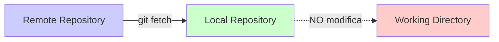

### 5.3 Git Commit

**`git commit`** guarda cambios en el repositorio local.

```bash
# Commit simple
git commit -m "mensaje del commit"

# Commit con mensaje largo
git commit -m "título" -m "descripción detallada"

# Commit interactivo (abre editor)
git commit

# Agregar todo y commit
git commit -am "mensaje"  # Solo archivos tracked

# Modificar último commit
git commit --amend -m "mensaje corregido"

# Commit vacío (útil para triggers)
git commit --allow-empty -m "trigger CI/CD"
```

**Buenas prácticas para mensajes:**
```bash
# ✅ BUENOS mensajes
git commit -m "feat: agregar autenticación con JWT"
git commit -m "fix: corregir cálculo de impuestos"
git commit -m "docs: actualizar README con ejemplos"

# ❌ MALOS mensajes
git commit -m "cambios"
git commit -m "fix"
git commit -m "asdf"
```

### 5.4 Git Pull

**`git pull`** descarga y fusiona cambios del remoto.

```bash
# Pull básico (fetch + merge)
git pull

# Pull de rama específica
git pull origin main

# Pull con rebase en lugar de merge
git pull --rebase

# Pull forzado (sobrescribe local)
git pull --force  # PELIGROSO
```

**Pull = Fetch + Merge:**
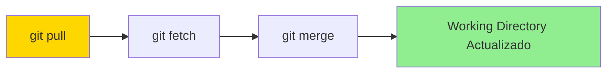

### 5.5 Git Push

**`git push`** sube cambios locales al repositorio remoto.

```bash
# Push simple
git push

# Push a rama específica
git push origin main

# Push y establecer upstream
git push -u origin mi-rama

# Push de todas las ramas
git push --all

# Push de tags
git push --tags

# Push forzado (CUIDADO!)
git push --force
git push --force-with-lease  # Más seguro
```

**Situaciones comunes:**
```bash
# Primera vez con una rama nueva
git push -u origin feature/nueva

# Después del rebase
git push --force-with-lease

# Eliminar rama remota
git push origin --delete rama-vieja
```

### 5.6 Git Merge

**`git merge`** fusiona una rama con otra.

```bash
# Merge básico
git merge feature-branch

# Merge sin fast-forward
git merge --no-ff feature-branch

# Merge con squash (un solo commit)
git merge --squash feature-branch

# Abortar merge en conflicto
git merge --abort
```

**Tipos de Merge:**

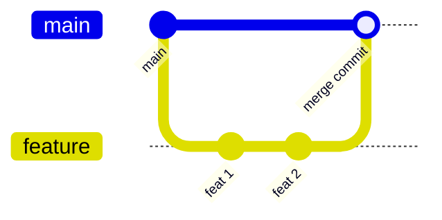

### 5.7 Git Log

**`git log`** muestra el historial de commits.

```bash
# Log básico
git log

# Log resumido
git log --oneline

# Log con gráfico
git log --graph --all --decorate

# Log con estadísticas
git log --stat

# Log de un archivo
git log -- archivo.txt

# Log por autor
git log --author="Juan"

# Log por fecha
git log --since="2 weeks ago"
git log --until="2024-01-01"

# Log con formato personalizado
git log --pretty=format:"%h - %an, %ar : %s"

# Log con búsqueda
git log --grep="bugfix"
```

**Alias útil para log bonito:**
```bash
git config --global alias.lg "log --graph --pretty=format:'%Cred%h%Creset -%C(yellow)%d%Creset %s %Cgreen(%cr) %C(bold blue)<%an>%Creset' --abbrev-commit"
```

### 5.8 Otras Formas de Administración de Versiones de Código Fuente

#### Comandos Adicionales Importantes

```bash
# STATUS - Ver estado actual
git status
git status -s  # Formato corto

# ADD - Agregar al staging
git add archivo.txt
git add *.js
git add .
git add -p  # Interactivo

# DIFF - Ver diferencias
git diff  # Working vs Staging
git diff --staged  # Staging vs Repo
git diff HEAD  # Working vs Repo

# BRANCH - Gestión de ramas
git branch  # Listar
git branch nueva  # Crear
git branch -d vieja  # Eliminar
git branch -m nuevo-nombre  # Renombrar

# CHECKOUT - Cambiar rama/commit
git checkout rama
git checkout -b nueva-rama
git checkout -- archivo.txt  # Descartar cambios

# RESET - Deshacer cambios
git reset --soft HEAD~1  # Deshacer commit, mantener cambios
git reset --mixed HEAD~1  # Default, unstage cambios
git reset --hard HEAD~1  # Eliminar todo

# STASH - Guardar temporalmente
git stash  # Guardar
git stash pop  # Recuperar
git stash list  # Ver lista
git stash apply  # Aplicar sin eliminar

# REBASE - Reorganizar historial
git rebase main
git rebase -i HEAD~3  # Interactivo

# CHERRY-PICK - Copiar commit
git cherry-pick abc123

# TAG - Etiquetar versiones
git tag v1.0.0
git tag -a v1.0.0 -m "Primera versión"
git push --tags

# REMOTE - Gestión de remotos
git remote -v
git remote add upstream url
git remote remove origin
git remote rename old new

# CLEAN - Limpiar archivos no tracked
git clean -n  # Dry run
git clean -f  # Forzar limpieza
git clean -fd  # Incluir directorios
```

#### Flujos de Trabajo Comunes

**1. Flujo Básico Diario**
```bash
# Mañana: actualizar tu código
git pull origin main

# Crear rama para tu tarea
git checkout -b feature/mi-tarea

# Trabajar y hacer commits
git add .
git commit -m "feat: implementar funcionalidad X"

# Subir cambios
git push -u origin feature/mi-tarea

# Crear Pull Request desde GitHub/GitLab
```

**2. Flujo con Conflictos**
```bash
# Actualizar main
git checkout main
git pull origin main

# Volver a tu rama
git checkout mi-rama

# Hacer rebase o merge
git rebase main
# O
git merge main

# Resolver conflictos si hay
# Editar archivos...
git add .
git rebase --continue
# O
git commit -m "resolver conflictos"

# Push (posiblemente force)
git push --force-with-lease
```

**3. Flujo Hotfix**
```bash
# Desde main/production
git checkout main
git pull origin main

# Crear hotfix
git checkout -b hotfix/bug-critico

# Hacer fix
git add .
git commit -m "hotfix: corregir bug crítico en producción"

# Merge rápido a main
git checkout main
git merge --no-ff hotfix/bug-critico
git push origin main

# También merge a develop
git checkout develop
git merge --no-ff hotfix/bug-critico
git push origin develop
```

---

## 📚 Resumen y Mejores Prácticas

### Comandos Esenciales para Memorizar

| Comando | Uso | Frecuencia |
|---------|-----|------------|
| `git status` | Ver estado | ⭐⭐⭐⭐⭐ |
| `git add .` | Agregar cambios | ⭐⭐⭐⭐⭐ |
| `git commit -m` | Guardar cambios | ⭐⭐⭐⭐⭐ |
| `git push` | Subir al remoto | ⭐⭐⭐⭐⭐ |
| `git pull` | Actualizar local | ⭐⭐⭐⭐⭐ |
| `git checkout -b` | Crear rama | ⭐⭐⭐⭐ |
| `git merge` | Fusionar ramas | ⭐⭐⭐ |
| `git log --oneline` | Ver historial | ⭐⭐⭐ |

### Flujo de Trabajo Recomendado

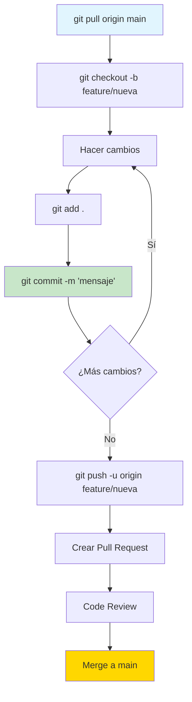

### Tips Finales

1. **Commits frecuentes**: Mejor muchos commits pequeños que uno gigante
2. **Mensajes descriptivos**: Tu yo futuro te lo agradecerá
3. **Pull antes de Push**: Evita conflictos
4. **Una rama por feature**: Mantén el trabajo organizado
5. **No temas experimentar**: Git permite deshacer casi todo
6. **Aprende los básicos bien**: Antes de comandos avanzados
7. **Usa alias**: Para comandos frecuentes
8. **Lee los mensajes de error**: Git suele sugerir la solución

### Recursos para Continuar Aprendiendo

- 📖 [Pro Git Book](https://git-scm.com/book/es/v2) - Libro oficial gratuito
- 🎮 [Learn Git Branching](https://learngitbranching.js.org/) - Tutorial interactivo
- 📺 [GitHub Learning Lab](https://lab.github.com/) - Cursos prácticos
- 🛠️ [Oh My Git!](https://ohmygit.org/) - Juego para aprender Git
- 📚 [Atlassian Git Tutorial](https://www.atlassian.com/git/tutorials) - Guías detalladas

---

*🚀 ¡Felicidades! Ahora tienes todo el conocimiento necesario para usar Git profesionalmente. La práctica constante te convertirá en un experto. ¡Happy coding!*