# Guía Práctica de HTML para Principiantes

## 📚 Tabla de Contenidos

1. [Historia y Evolución de HTML](#historia-y-evolución-de-html)
2. [¿Qué es HTML?](#qué-es-html)
3. [Conceptos Fundamentales](#conceptos-fundamentales)
4. [Tu Primera Página Web](#tu-primera-página-web)
5. [Estructura de una Página HTML](#estructura-de-una-página-html)
6. [Etiquetas Esenciales](#etiquetas-esenciales)
7. [Formularios](#formularios)
8. [Multimedia](#multimedia)
9. [Tablas](#tablas)
10. [HTML Semántico](#html-semántico)
11. [Mejores Prácticas](#mejores-prácticas)
12. [Recursos y Herramientas](#recursos-y-herramientas)

---

## 🕰️ Historia y Evolución de HTML

### El Nacimiento de la Web

HTML (HyperText Markup Language) fue creado en 1991 por **Tim Berners-Lee**, un físico del CERN en Suiza. Su objetivo era simple pero revolucionario: crear un sistema para compartir documentos científicos entre investigadores.

```mermaid
timeline
    title Evolución de HTML
    1991 : HTML 1.0
         : 18 etiquetas básicas
         : Tim Berners-Lee
    1995 : HTML 2.0
         : Primera especificación oficial
         : Formularios básicos
    1997 : HTML 3.2
         : W3C toma control
         : Tablas y applets
    1999 : HTML 4.01
         : Separación contenido/presentación
         : CSS para estilos
    2008 : HTML5 Draft
         : Multimedia nativa
         : APIs JavaScript
    2014 : HTML5 Oficial
         : Estándar actual
         : Web moderna
```



### ¿Por qué HTML Domina la Web?

1. **Simplicidad**: Fácil de aprender y usar
2. **Universalidad**: Funciona en cualquier navegador
3. **Flexibilidad**: Se adapta a diferentes dispositivos
4. **Evolución Constante**: HTML5 trajo capacidades modernas
5. **Ecosistema Rico**: Complementado por CSS y JavaScript

### HTML vs Otras Tecnologías

| Tecnología | Propósito | Relación con HTML |
|------------|-----------|-------------------|
| **XML** | Datos estructurados | HTML es una aplicación de XML |
| **Markdown** | Escritura simplificada | Se convierte a HTML |
| **Flash** | Multimedia rica | Obsoleto, reemplazado por HTML5 |
| **PDF** | Documentos fijos | HTML es más flexible y accesible |
| **Native Apps** | Aplicaciones móviles | HTML5 permite apps web |

---

## 🎯 ¿Qué es HTML?

HTML es el **lenguaje de marcado** estándar para crear páginas web. No es un lenguaje de programación, sino un lenguaje de **marcado** que define la estructura y el contenido de una página web.

### Conceptos Clave

```mermaid
graph TB
    HTML[HTML - Estructura] --> WEB[Página Web]
    CSS[CSS - Presentación] --> WEB
    JS[JavaScript - Comportamiento] --> WEB
    
    WEB --> BROWSER[Navegador]
    BROWSER --> USER[Usuario]
    
    style HTML fill:#e1f5fe
    style CSS fill:#f3e5f5
    style JS fill:#fff9c4
    style WEB fill:#c8e6c9
```



### Cómo Funciona una Página Web

```mermaid
sequenceDiagram
    participant U as Usuario
    participant B as Navegador
    participant S as Servidor
    participant D as DNS
    
    U->>B: Escribe URL
    B->>D: Resuelve dominio
    D->>B: IP del servidor
    B->>S: Solicita página (HTTP)
    S->>B: Envía HTML, CSS, JS
    B->>B: Renderiza página
    B->>U: Muestra página
```



### Páginas Estáticas vs Dinámicas

| Característica | Páginas Estáticas | Páginas Dinámicas |
|---------------|-------------------|-------------------|
| **Contenido** | Fijo, no cambia | Cambia según usuario/tiempo |
| **Servidor** | Solo envía archivos | Procesa y genera contenido |
| **Ejemplos** | Portfolio, landing page | Facebook, Amazon |
| **Tecnologías** | HTML, CSS, JS | + PHP, Python, Node.js |
| **Velocidad** | Muy rápidas | Depende del procesamiento |

---

## 🔑 Conceptos Fundamentales

### Elementos y Etiquetas

Un **elemento** HTML consiste en:
- **Etiqueta de apertura**: `<p>`
- **Contenido**: El texto o elementos internos
- **Etiqueta de cierre**: `</p>`

```html
<p>Este es un párrafo completo</p>
```

### Atributos

Los atributos proporcionan información adicional sobre los elementos:

```html

```

### Anidamiento

Los elementos pueden contener otros elementos:

```html
<div>
    <h1>Título</h1>
    <p>Este párrafo está <strong>dentro</strong> del div.</p>
</div>
```

### Elementos Vacíos

Algunos elementos no tienen contenido:

```html
<br>  <!-- Salto de línea -->
<hr>  <!-- Línea horizontal -->
  <!-- Imagen -->
```

---

## 🚀 Tu Primera Página Web

### Código Completo

```html
<!DOCTYPE html>
<html lang="es">
<head>
    <meta charset="UTF-8">
    <meta name="viewport" content="width=device-width, initial-scale=1.0">
    <title>Mi Primera Página Web</title>
</head>
<body>
    <h1>¡Hola Mundo!</h1>
    <p>Esta es mi primera página web.</p>
    <p>Estoy aprendiendo HTML y es <strong>genial</strong>!</p>
</body>
</html>
```

### Explicación Línea por Línea

1. `<!DOCTYPE html>` - Declara que es HTML5
2. `<html lang="es">` - Elemento raíz, idioma español
3. `<head>` - Metadatos (no visible en la página)
4. `<meta charset="UTF-8">` - Codificación de caracteres
5. `<meta name="viewport">` - Diseño responsive
6. `<title>` - Título en la pestaña del navegador
7. `<body>` - Contenido visible de la página

### Cómo Crear y Ver tu Página

1. **Crear el archivo**:
   - Abre un editor de texto (VS Code, Sublime, Notepad++)
   - Copia el código anterior
   - Guarda como `index.html`

2. **Abrir en navegador**:
   - Doble clic en el archivo
   - O arrastra al navegador
   - O clic derecho → "Abrir con" → Chrome/Firefox

---

## 🏗️ Estructura de una Página HTML

### Anatomía Completa


### Plantilla HTML5 Moderna

```html
<!DOCTYPE html>
<html lang="es">
<head>
    <!-- Metadatos básicos -->
    <meta charset="UTF-8">
    <meta name="viewport" content="width=device-width, initial-scale=1.0">
    <meta name="description" content="Descripción de tu página para SEO">
    <meta name="keywords" content="palabras, clave, para, búsqueda">
    <meta name="author" content="Tu Nombre">
    
    <!-- Título de la página -->
    <title>Título de tu Página</title>
    
    <!-- Enlaces a CSS -->
    <link rel="stylesheet" href="styles.css">
    
    <!-- Favicon -->
    <link rel="icon" type="image/png" href="favicon.png">
</head>
<body>
    <!-- Cabecera -->
    <header>
        <h1>Logo o Título Principal</h1>
        <nav>
            <ul>
                <li><a href="#inicio">Inicio</a></li>
                <li><a href="#sobre">Sobre Nosotros</a></li>
                <li><a href="#contacto">Contacto</a></li>
            </ul>
        </nav>
    </header>
    
    <!-- Contenido principal -->
    <main>
        <section>
            <h2>Sección Principal</h2>
            <article>
                <h3>Artículo</h3>
                <p>Contenido del artículo...</p>
            </article>
        </section>
        
        <aside>
            <h3>Barra lateral</h3>
            <p>Contenido relacionado...</p>
        </aside>
    </main>
    
    <!-- Pie de página -->
    <footer>
        <p>&copy; 2024 Mi Sitio Web. Todos los derechos reservados.</p>
    </footer>
    
    <!-- Scripts de JavaScript -->
    <script src="script.js"></script>
</body>
</html>
```

---

## 📝 Etiquetas Esenciales

### Texto y Formato

#### Encabezados

```html
<h1>Encabezado 1 - Más importante</h1>
<h2>Encabezado 2</h2>
<h3>Encabezado 3</h3>
<h4>Encabezado 4</h4>
<h5>Encabezado 5</h5>
<h6>Encabezado 6 - Menos importante</h6>
```

#### Párrafos y Texto

```html
<!-- Párrafo normal -->
<p>Este es un párrafo de texto normal.</p>

<!-- Salto de línea -->
<p>Primera línea<br>Segunda línea</p>

<!-- Línea horizontal -->
<hr>

<!-- Formato de texto -->
<p>
    Texto <strong>importante (negrita)</strong><br>
    Texto <em>enfatizado (cursiva)</em><br>
    Texto <mark>resaltado</mark><br>
    Texto <small>pequeño</small><br>
    Texto <del>eliminado</del><br>
    Texto <ins>insertado</ins><br>
    Texto <sub>subíndice</sub> y <sup>superíndice</sup><br>
    <code>código en línea</code>
</p>

<!-- Bloque de código -->
<pre>
<code>
function saludar() {
    console.log("Hola Mundo");
}
</code>
</pre>

<!-- Cita -->
<blockquote>
    "El HTML es el esqueleto de la web."
    <cite>- Tim Berners-Lee</cite>
</blockquote>
```

### Enlaces (Links)

```html
<!-- Enlace básico -->
<a href="https://www.google.com">Ir a Google</a>

<!-- Enlace en nueva pestaña -->
<a href="https://www.github.com" target="_blank">GitHub (nueva pestaña)</a>

<!-- Enlace a otra página del sitio -->
<a href="contacto.html">Contacto</a>

<!-- Enlace a sección de la misma página -->
<a href="#seccion1">Ir a Sección 1</a>

<!-- Enlace de correo -->
<a href="mailto:correo@ejemplo.com">Enviar email</a>

<!-- Enlace de teléfono -->
<a href="tel:+507-6000-0000">Llamar</a>

<!-- Enlace de descarga -->
<a href="documento.pdf" download>Descargar PDF</a>

<!-- Enlace con imagen -->
<a href="galeria.html">
    
</a>
```

### Imágenes

```html
<!-- Imagen básica -->


<!-- Imagen con dimensiones -->


<!-- Imagen responsive -->


<!-- Imagen con múltiples fuentes (responsive) -->
<picture>
    <source media="(min-width: 650px)" srcset="img-grande.jpg">
    <source media="(min-width: 465px)" srcset="img-mediana.jpg">
    
</picture>

<!-- Figure con caption -->
<figure>
    
    <figcaption>Ventas del año 2024</figcaption>
</figure>
```

### Listas

```html
<!-- Lista desordenada -->
<ul>
    <li>Elemento 1</li>
    <li>Elemento 2</li>
    <li>Elemento 3</li>
</ul>

<!-- Lista ordenada -->
<ol>
    <li>Primer paso</li>
    <li>Segundo paso</li>
    <li>Tercer paso</li>
</ol>

<!-- Lista ordenada con tipo -->
<ol type="A"> <!-- A, a, I, i, 1 -->
    <li>Opción A</li>
    <li>Opción B</li>
</ol>

<!-- Lista de definiciones -->
<dl>
    <dt>HTML</dt>
    <dd>HyperText Markup Language</dd>
    
    <dt>CSS</dt>
    <dd>Cascading Style Sheets</dd>
</dl>

<!-- Listas anidadas -->
<ul>
    <li>Frutas
        <ul>
            <li>Manzana</li>
            <li>Pera</li>
        </ul>
    </li>
    <li>Verduras
        <ul>
            <li>Zanahoria</li>
            <li>Lechuga</li>
        </ul>
    </li>
</ul>
```

---

## 📋 Formularios

### Estructura Básica

```html
<form action="/procesar" method="POST">
    <!-- Elementos del formulario -->
    <button type="submit">Enviar</button>
</form>
```

### Campos de Entrada (Input Types)

```html
<form>
    <!-- Texto simple -->
    <label for="nombre">Nombre:</label>
    <input type="text" id="nombre" name="nombre" required>
    
    <!-- Email -->
    <label for="email">Email:</label>
    <input type="email" id="email" name="email" required>
    
    <!-- Contraseña -->
    <label for="password">Contraseña:</label>
    <input type="password" id="password" name="password" minlength="8">
    
    <!-- Número -->
    <label for="edad">Edad:</label>
    <input type="number" id="edad" name="edad" min="1" max="120">
    
    <!-- Teléfono -->
    <label for="telefono">Teléfono:</label>
    <input type="tel" id="telefono" name="telefono" pattern="[0-9]{4}-[0-9]{4}">
    
    <!-- Fecha -->
    <label for="fecha">Fecha de nacimiento:</label>
    <input type="date" id="fecha" name="fecha">
    
    <!-- Hora -->
    <label for="hora">Hora de cita:</label>
    <input type="time" id="hora" name="hora">
    
    <!-- Color -->
    <label for="color">Color favorito:</label>
    <input type="color" id="color" name="color">
    
    <!-- Rango -->
    <label for="volumen">Volumen:</label>
    <input type="range" id="volumen" name="volumen" min="0" max="100">
    
    <!-- URL -->
    <label for="sitio">Sitio web:</label>
    <input type="url" id="sitio" name="sitio">
    
    <!-- Búsqueda -->
    <label for="buscar">Buscar:</label>
    <input type="search" id="buscar" name="buscar">
    
    <!-- Archivo -->
    <label for="archivo">Subir archivo:</label>
    <input type="file" id="archivo" name="archivo" accept=".pdf,.doc">
    
    <!-- Campo oculto -->
    <input type="hidden" name="id_usuario" value="12345">
</form>
```

### Elementos de Selección

```html
<!-- Checkbox -->
<input type="checkbox" id="terminos" name="terminos" value="aceptado">
<label for="terminos">Acepto los términos y condiciones</label>

<!-- Múltiples checkboxes -->
<fieldset>
    <legend>Selecciona tus hobbies:</legend>
    <input type="checkbox" id="deporte" name="hobbies" value="deporte">
    <label for="deporte">Deporte</label><br>
    
    <input type="checkbox" id="lectura" name="hobbies" value="lectura">
    <label for="lectura">Lectura</label><br>
    
    <input type="checkbox" id="musica" name="hobbies" value="musica">
    <label for="musica">Música</label>
</fieldset>

<!-- Radio buttons -->
<fieldset>
    <legend>Género:</legend>
    <input type="radio" id="masculino" name="genero" value="M">
    <label for="masculino">Masculino</label><br>
    
    <input type="radio" id="femenino" name="genero" value="F">
    <label for="femenino">Femenino</label><br>
    
    <input type="radio" id="otro" name="genero" value="O">
    <label for="otro">Otro</label>
</fieldset>

<!-- Lista desplegable -->
<label for="pais">País:</label>
<select id="pais" name="pais">
    <option value="">Seleccione un país</option>
    <option value="PA">Panamá</option>
    <option value="CR">Costa Rica</option>
    <option value="CO">Colombia</option>
    <option value="MX">México</option>
</select>

<!-- Lista múltiple -->
<label for="idiomas">Idiomas (múltiple):</label>
<select id="idiomas" name="idiomas" multiple size="4">
    <option value="es">Español</option>
    <option value="en">Inglés</option>
    <option value="fr">Francés</option>
    <option value="de">Alemán</option>
</select>

<!-- Área de texto -->
<label for="comentarios">Comentarios:</label>
<textarea id="comentarios" name="comentarios" rows="5" cols="50">
    Escribe aquí tus comentarios...
</textarea>

<!-- Datalist (sugerencias) -->
<label for="navegador">Navegador favorito:</label>
<input list="navegadores" id="navegador" name="navegador">
<datalist id="navegadores">
    <option value="Chrome">
    <option value="Firefox">
    <option value="Safari">
    <option value="Edge">
</datalist>
```

### Botones

```html
<!-- Botón de envío -->
<button type="submit">Enviar Formulario</button>

<!-- Botón de reset -->
<button type="reset">Limpiar Formulario</button>

<!-- Botón normal -->
<button type="button" onclick="alert('Hola!')">Saludar</button>

<!-- Input como botón -->
<input type="submit" value="Enviar">
<input type="reset" value="Resetear">
<input type="button" value="Clic aquí" onclick="miFuncion()">
```

### Formulario Completo de Ejemplo

```html
<form action="/registro" method="POST">
    <h2>Formulario de Registro</h2>
    
    <fieldset>
        <legend>Información Personal</legend>
        
        <label for="nombre">Nombre completo:*</label>
        <input type="text" id="nombre" name="nombre" required><br><br>
        
        <label for="email">Email:*</label>
        <input type="email" id="email" name="email" required><br><br>
        
        <label for="fecha_nac">Fecha de nacimiento:</label>
        <input type="date" id="fecha_nac" name="fecha_nac"><br><br>
        
        <label for="telefono">Teléfono:</label>
        <input type="tel" id="telefono" name="telefono" 
               placeholder="6000-0000"><br><br>
    </fieldset>
    
    <fieldset>
        <legend>Cuenta de Usuario</legend>
        
        <label for="usuario">Nombre de usuario:*</label>
        <input type="text" id="usuario" name="usuario" 
               minlength="4" maxlength="20" required><br><br>
        
        <label for="password">Contraseña:*</label>
        <input type="password" id="password" name="password" 
               minlength="8" required><br><br>
        
        <label for="confirmar">Confirmar contraseña:*</label>
        <input type="password" id="confirmar" name="confirmar" 
               minlength="8" required><br><br>
    </fieldset>
    
    <fieldset>
        <legend>Preferencias</legend>
        
        <label for="newsletter">
            <input type="checkbox" id="newsletter" name="newsletter">
            Deseo recibir el boletín informativo
        </label><br><br>
        
        <label for="terminos">
            <input type="checkbox" id="terminos" name="terminos" required>
            Acepto los términos y condiciones*
        </label><br><br>
    </fieldset>
    
    <button type="submit">Registrarse</button>
    <button type="reset">Limpiar</button>
    
    <p><small>* Campos obligatorios</small></p>
</form>
```

---

## 🎬 Multimedia

### Video

```html
<!-- Video básico con controles -->
<video controls width="640" height="360">
    <source src="video.mp4" type="video/mp4">
    <source src="video.webm" type="video/webm">
    Tu navegador no soporta el elemento video.
</video>

<!-- Video con más opciones -->
<video controls autoplay muted loop poster="miniatura.jpg">
    <source src="intro.mp4" type="video/mp4">
    <track src="subtitulos.vtt" kind="subtitles" srclang="es" label="Español">
</video>

<!-- Video responsive -->
<video style="width: 100%; height: auto;" controls>
    <source src="responsive.mp4" type="video/mp4">
</video>
```

### Audio

```html
<!-- Audio básico -->
<audio controls>
    <source src="cancion.mp3" type="audio/mpeg">
    <source src="cancion.ogg" type="audio/ogg">
    Tu navegador no soporta el elemento audio.
</audio>

<!-- Audio con opciones -->
<audio controls autoplay loop>
    <source src="musica-fondo.mp3" type="audio/mpeg">
</audio>

<!-- Audio sin controles (para música de fondo) -->
<audio autoplay loop>
    <source src="ambiente.mp3" type="audio/mpeg">
</audio>
```

### Iframe (Contenido Embebido)

```html
<!-- Video de YouTube -->
<iframe width="560" height="315" 
        src="https://www.youtube.com/embed/VIDEO_ID" 
        frameborder="0" 
        allowfullscreen>
</iframe>

<!-- Mapa de Google Maps -->
<iframe src="https://www.google.com/maps/embed?..." 
        width="600" 
        height="450" 
        style="border:0;" 
        allowfullscreen="" 
        loading="lazy">
</iframe>

<!-- Documento PDF -->
<iframe src="documento.pdf" 
        width="100%" 
        height="600">
</iframe>

<!-- Otra página web -->
<iframe src="https://ejemplo.com" 
        width="100%" 
        height="400"
        sandbox="allow-scripts allow-same-origin">
</iframe>
```

### Canvas y SVG

```html
<!-- Canvas para gráficos con JavaScript -->
<canvas id="miCanvas" width="400" height="200">
    Tu navegador no soporta canvas.
</canvas>

<!-- SVG inline -->
<svg width="100" height="100">
    <circle cx="50" cy="50" r="40" fill="blue" />
</svg>

<!-- SVG como imagen -->

```

---

## 📊 Tablas

### Estructura Básica

```html
<table>
    <thead>
        <tr>
            <th>Encabezado 1</th>
            <th>Encabezado 2</th>
            <th>Encabezado 3</th>
        </tr>
    </thead>
    <tbody>
        <tr>
            <td>Dato 1</td>
            <td>Dato 2</td>
            <td>Dato 3</td>
        </tr>
        <tr>
            <td>Dato 4</td>
            <td>Dato 5</td>
            <td>Dato 6</td>
        </tr>
    </tbody>
</table>
```

### Tabla Completa con Características

```html
<table border="1">
    <caption>Ventas Mensuales 2024</caption>
    <thead>
        <tr>
            <th>Mes</th>
            <th>Producto A</th>
            <th>Producto B</th>
            <th>Total</th>
        </tr>
    </thead>
    <tbody>
        <tr>
            <td>Enero</td>
            <td>$1,000</td>
            <td>$1,500</td>
            <td>$2,500</td>
        </tr>
        <tr>
            <td>Febrero</td>
            <td>$1,200</td>
            <td>$1,800</td>
            <td>$3,000</td>
        </tr>
    </tbody>
    <tfoot>
        <tr>
            <th>Total</th>
            <th>$2,200</th>
            <th>$3,300</th>
            <th>$5,500</th>
        </tr>
    </tfoot>
</table>
```

### Celdas Combinadas

```html
<table border="1">
    <tr>
        <th colspan="2">Encabezado que ocupa 2 columnas</th>
    </tr>
    <tr>
        <td rowspan="2">Celda que ocupa 2 filas</td>
        <td>Celda normal</td>
    </tr>
    <tr>
        <td>Otra celda</td>
    </tr>
</table>
```

### Tabla Responsiva (con CSS inline)

```html
<div style="overflow-x: auto;">
    <table style="width: 100%; border-collapse: collapse;">
        <thead style="background-color: #f2f2f2;">
            <tr>
                <th style="padding: 12px; text-align: left;">Nombre</th>
                <th style="padding: 12px; text-align: left;">Email</th>
                <th style="padding: 12px; text-align: left;">Teléfono</th>
            </tr>
        </thead>
        <tbody>
            <tr>
                <td style="padding: 12px; border-bottom: 1px solid #ddd;">Juan Pérez</td>
                <td style="padding: 12px; border-bottom: 1px solid #ddd;">juan@email.com</td>
                <td style="padding: 12px; border-bottom: 1px solid #ddd;">6000-0000</td>
            </tr>
        </tbody>
    </table>
</div>
```

---

## 🏛️ HTML Semántico

### ¿Qué es HTML Semántico?

HTML semántico usa elementos que describen claramente su significado tanto para el navegador como para el desarrollador.

```mermaid
graph LR
    A[Antes - Divs genéricos] --> B[div class='header']
    A --> C[div class='nav']
    A --> D[div class='content']
    A --> E[div class='footer']
    
    F[Ahora - HTML5 Semántico] --> G[header]
    F --> H[nav]
    F --> I[main]
    F --> J[footer]
    
    style F fill:#c8e6c9
    style G fill:#a5d6a7
    style H fill:#a5d6a7
    style I fill:#a5d6a7
    style J fill:#a5d6a7
```



### Elementos Semánticos Principales

```html
<!DOCTYPE html>
<html lang="es">
<head>
    <title>Página Semántica</title>
</head>
<body>
    <!-- Cabecera del sitio -->
    <header>
        <h1>Mi Sitio Web</h1>
        <nav>
            <ul>
                <li><a href="#home">Inicio</a></li>
                <li><a href="#about">Acerca de</a></li>
                <li><a href="#contact">Contacto</a></li>
            </ul>
        </nav>
    </header>
    
    <!-- Contenido principal -->
    <main>
        <!-- Sección temática -->
        <section id="noticias">
            <h2>Últimas Noticias</h2>
            
            <!-- Artículo independiente -->
            <article>
                <header>
                    <h3>Título del Artículo</h3>
                    <time datetime="2024-01-15">15 de enero, 2024</time>
                </header>
                <p>Contenido del artículo...</p>
                <footer>
                    <p>Escrito por <address>autor@ejemplo.com</address></p>
                </footer>
            </article>
            
            <article>
                <h3>Otro Artículo</h3>
                <p>Más contenido...</p>
            </article>
        </section>
        
        <!-- Contenido tangencial -->
        <aside>
            <h3>Enlaces Relacionados</h3>
            <ul>
                <li><a href="#">Enlace 1</a></li>
                <li><a href="#">Enlace 2</a></li>
            </ul>
        </aside>
    </main>
    
    <!-- Pie de página -->
    <footer>
        <p>&copy; 2024 Mi Sitio Web</p>
        <address>
            Contacto: <a href="mailto:info@ejemplo.com">info@ejemplo.com</a>
        </address>
    </footer>
</body>
</html>
```

### Otros Elementos Semánticos

```html
<!-- Figura con descripción -->
<figure>
    
    <figcaption>Ventas del último trimestre</figcaption>
</figure>

<!-- Detalles expandibles -->
<details>
    <summary>Ver más información</summary>
    <p>Aquí está la información adicional que estaba oculta.</p>
</details>

<!-- Marcado de tiempo -->
<time datetime="2024-12-25T09:00">25 de diciembre a las 9:00 AM</time>

<!-- Progreso -->
<progress value="70" max="100">70%</progress>

<!-- Medidor -->
<meter value="6" min="0" max="10">6 de 10</meter>

<!-- Texto marcado/resaltado -->
<p>El resultado más importante es <mark>este texto resaltado</mark>.</p>

<!-- Salida de un cálculo -->
<p>El total es: <output>150</output></p>
```

### Beneficios del HTML Semántico

1. **Accesibilidad**: Lectores de pantalla entienden mejor la estructura
2. **SEO**: Motores de búsqueda indexan mejor el contenido
3. **Mantenibilidad**: Código más claro y fácil de entender
4. **Consistencia**: Estructura estándar entre proyectos
5. **Futuro**: Preparado para nuevas tecnologías

---

## ✅ Mejores Prácticas

### 1. Estructura y Organización

```html
<!-- ✅ BIEN: Indentación consistente -->
<div>
    <h1>Título</h1>
    <p>Párrafo</p>
    <ul>
        <li>Item 1</li>
        <li>Item 2</li>
    </ul>
</div>

<!-- ❌ MAL: Sin indentación -->
<div>
<h1>Título</h1>
<p>Párrafo</p>
<ul>
<li>Item 1</li>
<li>Item 2</li>
</ul>
</div>
```

### 2. Uso de Atributos

```html
<!-- ✅ BIEN: Atributos descriptivos -->

<a href="contacto.html" title="Ir a la página de contacto">Contacto</a>

<!-- ❌ MAL: Sin atributos importantes -->

<a href="page2.html">Click aquí</a>
```

### 3. Accesibilidad

```html
<!-- ✅ BIEN: Accesible -->
<form>
    <label for="email">Email:</label>
    <input type="email" id="email" name="email" required aria-required="true">
    
    <button type="submit">Enviar</button>
</form>

<!-- Navegación accesible -->
<nav aria-label="Navegación principal">
    <ul>
        <li><a href="#content" class="skip-link">Saltar al contenido</a></li>
        <li><a href="/">Inicio</a></li>
    </ul>
</nav>

<!-- ❌ MAL: No accesible -->
<input type="text" placeholder="Email">
<div onclick="submit()">Enviar</div>
```

### 4. SEO (Optimización para Motores de Búsqueda)

```html
<head>
    <!-- ✅ Meta tags importantes para SEO -->
    <meta charset="UTF-8">
    <meta name="viewport" content="width=device-width, initial-scale=1.0">
    <meta name="description" content="Descripción clara de tu página (150-160 caracteres)">
    <meta name="keywords" content="palabra1, palabra2, palabra3">
    <meta name="author" content="Tu Nombre">
    
    <!-- Open Graph para redes sociales -->
    <meta property="og:title" content="Título para compartir">
    <meta property="og:description" content="Descripción para redes sociales">
    <meta property="og:image" content="https://ejemplo.com/imagen.jpg">
    <meta property="og:url" content="https://ejemplo.com">
    
    <!-- Título único y descriptivo -->
    <title>Título Único - Nombre del Sitio</title>
    
    <!-- Canonical URL -->
    <link rel="canonical" href="https://ejemplo.com/pagina">
</head>
```

### 5. Rendimiento

```html
<!-- ✅ BIEN: Optimizado para carga -->
<!-- Lazy loading para imágenes -->


<!-- Preload de recursos críticos -->
<link rel="preload" href="fuente.woff2" as="font" type="font/woff2" crossorigin>

<!-- Async/Defer para scripts -->
<script src="script.js" defer></script>
<script src="analytics.js" async></script>

<!-- ❌ MAL: Sin optimización -->

<script src="script1.js"></script>
<script src="script2.js"></script>
<script src="script3.js"></script>
```

### 6. Validación HTML

Siempre valida tu HTML usando:
- [W3C Validator](https://validator.w3.org/)
- Extensiones de VS Code como "HTML Hint"

### 7. Comentarios Útiles

```html
<!-- ✅ BIEN: Comentarios informativos -->
<!-- Inicio de la sección de productos destacados -->
<section id="productos-destacados">
    <!-- Cada producto es un artículo independiente -->
    <article>...</article>
</section>
<!-- Fin de productos destacados -->

<!-- ❌ MAL: Comentarios obvios o innecesarios -->
<!-- Este es un div -->
<div>
    <!-- Este es un párrafo -->
    <p>Texto</p>
</div>
```

### 8. Nombres de Archivos y Rutas

```html
<!-- ✅ BIEN: Nombres descriptivos y consistentes -->
<link rel="stylesheet" href="css/estilos-principales.css">
<script src="js/validacion-formulario.js"></script>


<!-- ❌ MAL: Nombres confusos -->
<link rel="stylesheet" href="style2.css">
<script src="script.js"></script>

```

---

## 🛠️ Recursos y Herramientas

### Editores de Código Recomendados

1. **Visual Studio Code** (Gratuito)
   - Extensiones útiles:
     - Live Server
     - HTML CSS Support
     - Auto Rename Tag
     - Prettier

2. **Sublime Text** (Evaluación gratuita)
3. **Atom** (Gratuito)
4. **Brackets** (Gratuito, especializado en web)
5. **WebStorm** (Pago, muy completo)

### Herramientas Online

- **CodePen**: [codepen.io](https://codepen.io) - Editor online con preview
- **JSFiddle**: [jsfiddle.net](https://jsfiddle.net) - Pruebas rápidas
- **StackBlitz**: [stackblitz.com](https://stackblitz.com) - IDE completo online
- **W3Schools Tryit**: Editor con ejemplos

### Validadores y Comprobadores

- **W3C Markup Validator**: [validator.w3.org](https://validator.w3.org/)
- **HTML5 Validator**: [html5.validator.nu](https://html5.validator.nu/)
- **WAVE**: Herramienta de accesibilidad
- **Lighthouse**: En Chrome DevTools

### Recursos de Aprendizaje

#### Documentación Oficial
- **MDN Web Docs**: [developer.mozilla.org](https://developer.mozilla.org/es/)
- **W3Schools**: [w3schools.com](https://www.w3schools.com/)
- **HTML Standard**: [html.spec.whatwg.org](https://html.spec.whatwg.org/)

#### Cursos Interactivos
- **freeCodeCamp**: Certificación gratuita
- **Codecademy**: Curso interactivo de HTML
- **Khan Academy**: Fundamentos de HTML/CSS

#### Canales de YouTube
- **Traversy Media**: Tutoriales prácticos
- **The Net Ninja**: Series completas
- **Kevin Powell**: CSS y diseño web

### Frameworks CSS para Empezar Rápido

Una vez domines HTML, puedes usar frameworks CSS:

1. **Bootstrap**: El más popular
2. **Tailwind CSS**: Utility-first
3. **Bulma**: Simple y moderno
4. **Foundation**: Profesional
5. **Materialize**: Diseño Material

### Inspiración y Referencias

- **Dribbble**: Diseños de interfaces
- **Behance**: Portfolios de diseño
- **Awwwards**: Mejores sitios web
- **CodePen**: Ejemplos y experimentos
- **CSS-Tricks**: Técnicas avanzadas

---

## 🎯 Proyecto de Práctica: Portfolio Personal

### Estructura Sugerida

```
portfolio/
├── index.html          # Página principal
├── sobre-mi.html       # Página "Acerca de"
├── proyectos.html      # Galería de proyectos
├── contacto.html       # Formulario de contacto
├── css/
│   └── estilos.css    # Estilos (siguiente curso)
├── img/
│   ├── foto-perfil.jpg
│   └── proyectos/
└── js/
    └── script.js       # JavaScript (futuro)
```

### Código Base para Empezar

```html
<!DOCTYPE html>
<html lang="es">
<head>
    <meta charset="UTF-8">
    <meta name="viewport" content="width=device-width, initial-scale=1.0">
    <title>Mi Portfolio - Tu Nombre</title>
    <meta name="description" content="Portfolio de desarrollo web de Tu Nombre">
</head>
<body>
    <header>
        <nav>
            <ul>
                <li><a href="index.html">Inicio</a></li>
                <li><a href="sobre-mi.html">Sobre Mí</a></li>
                <li><a href="proyectos.html">Proyectos</a></li>
                <li><a href="contacto.html">Contacto</a></li>
            </ul>
        </nav>
    </header>
    
    <main>
        <section id="hero">
            <h1>Hola, soy [Tu Nombre]</h1>
            <p>Desarrollador Web en Formación</p>
            
        </section>
        
        <section id="habilidades">
            <h2>Mis Habilidades</h2>
            <ul>
                <li>HTML5</li>
                <li>CSS3 (Aprendiendo)</li>
                <li>JavaScript (Próximamente)</li>
            </ul>
        </section>
        
        <section id="proyectos-destacados">
            <h2>Proyectos Recientes</h2>
            <article>
                <h3>Proyecto 1</h3>
                <p>Descripción del proyecto...</p>
                <a href="proyectos.html">Ver más</a>
            </article>
        </section>
    </main>
    
    <footer>
        <p>&copy; 2024 Tu Nombre. Todos los derechos reservados.</p>
        <p>
            <a href="mailto:tu@email.com">Email</a> |
            <a href="https://github.com/tuusuario" target="_blank">GitHub</a> |
            <a href="https://linkedin.com/in/tuusuario" target="_blank">LinkedIn</a>
        </p>
    </footer>
</body>
</html>
```

---

## 🎓 Resumen y Siguientes Pasos

### Lo que has aprendido

✅ **Fundamentos de HTML**:
- Estructura básica de una página web
- Etiquetas y atributos
- Elementos de texto y formato

✅ **Contenido Multimedia**:
- Imágenes y su optimización
- Video y audio HTML5
- Contenido embebido

✅ **Interactividad**:
- Enlaces y navegación
- Formularios completos
- Tipos de input modernos

✅ **Estructura Semántica**:
- HTML5 semántico
- Accesibilidad básica
- SEO fundamental

### Siguientes Pasos

1. **CSS (Siguiente tema)**: Aprende a dar estilo y diseño a tus páginas
2. **JavaScript**: Agrega interactividad y dinamismo
3. **Responsive Design**: Haz que tus páginas se vean bien en todos los dispositivos
4. **Frameworks**: Aprende Bootstrap o Tailwind CSS
5. **Backend**: Aprende un lenguaje servidor (PHP, Python, Node.js)

### Consejos Finales

1. **Practica diariamente**: Crea pequeños proyectos constantemente
2. **Lee código de otros**: Inspecciona sitios web que te gusten
3. **Mantente actualizado**: HTML evoluciona, sigue aprendiendo
4. **Construye proyectos reales**: Portfolio, blog, sitio para un negocio local
5. **Comparte tu trabajo**: GitHub, CodePen, tu propio sitio web

---

*🚀 ¡Felicidades! Ya tienes las bases para crear páginas web. El HTML es el primer paso en tu viaje como desarrollador web. ¡Sigue practicando y construyendo!*